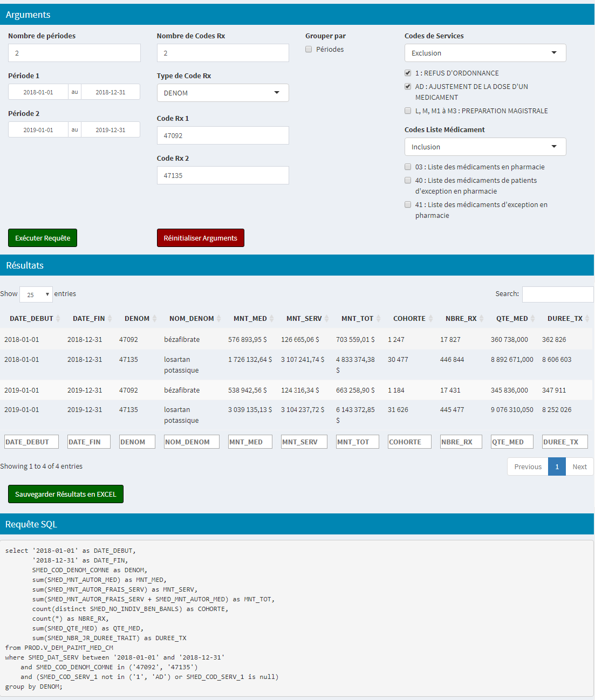

\pagestyle{fancy}
\fancyhead[RE,RO]{\leftmark}

```{r setup, include=FALSE}
knitr::opts_chunk$set(echo = FALSE, results = "asis",
                      warning = FALSE, message = FALSE)
library(inesss)
library(data.table)
library(kableExtra)
library(knitr)
library(stringr)
conn <- params$conn
# conn <- SQL_connexion(askpass::askpass("User"), askpass::askpass("Password"))

# Fonctions internes
replace_NA_in_dt <- inesss:::replace_NA_in_dt
list_as_dt_no_recycled <- inesss:::list_as_dt_no_recycled
rmNA <- inesss:::rmNA

# Afficher un tableau grâce à kableExtra
kable_tab <- function(x, scale_down = TRUE) {
  p <- kable(x, "latex", booktabs = TRUE, row.names = FALSE, linesep = "",
             align = "r") %>%
    kable_styling(latex_options = rmNA(c("hold_position", "repeat_header",
                                         ifelse(scale_down, "scale_down", NA))))
  return(cat(p))
}
# Formats
price_format <- function(x) {  # format prix
  return(sapply(x, function(x) {
    formatC(x, digits = 2, format = "f", big.mark = " ", decimal.mark = ",")
  }))
}
number_format <- function(x, digi = 0) {  # nombre en général
  return(sapply(x, function(x) {
    formatC(x, digits = digi, format = "f", big.mark = " ", decimal.mark = ",")
  }))
}

# Automatic format table
sg1_format_table <- function(dt) {
  dt[, `:=` (MNT_MED = price_format(MNT_MED),
             MNT_SERV = price_format(MNT_SERV),
             MNT_TOT = price_format(MNT_TOT),
             COHORTE = number_format(COHORTE),
             NBRE_RX = number_format(NBRE_RX),
             QTE_MED = number_format(QTE_MED, digi = 3),
             DUREE_TX = number_format(DUREE_TX))]
}

# NULL if NA
NULL_if_NA <- function(x) {
  if (all(is.na(x))) {
    return(NULL)
  } else {
    return(x)
  }
}
```


<!-- LaTeX function -->
\newcommand{\nl}{\textcolor{white}{.  }} <!-- 'hack' pour en-tête lvl 4 : nouvelle ligne (\newline) -->
<!--                -->

# Démarrer le formulaire
À partir de *RStudio*, cliquer sur *Addins*, puis sur *Formulaire*.

{ width=60% }


\pagebreak


# Connexion
Établir une connexion entre *R* et *Teradata*.

1. Inscrire le nom d'utilisateur (commence généralement par *MS*) et le mot de passe.
2. Cliquer sur le bouton *Connexion*. S'il n'y a pas d'erreur, le mot *Connexion* suivi de la date et l'heure s'affichera. Modifier l'identifiant ou le mot de passe au besoin.
3. Cliquer sur le bouton *Déconnexion* (ou fermer la fenêtre du formulaire) pour terminer la connexion SQL.

**Attention : ** Si le mot de passe est expiré, une fenêtre demandant un nouveau mot de passe apparaîtra **en arrière-plan**. Sélectionner cette fenêtre et entrer le nouveau mot de passe.

{ width=80% }


\pagebreak


# Requêtes via Excel
Exécution d'une ou plusieurs requêtes par l'intermédiaire d'un fichier Excel. Chaque onglet doit contenir un tableau indiquant les arguments d'une méthode. Il est fortement conseillé d'utiliser [les gabarits disponibles](https://github.com/INESSS-QC/inesss1/tree/master/Documentation/Gabarits).

1. Cliquer sur le bouton *Sélectionner fichier Excel* pour sélectionner le fichier Excel contenant la ou les requêtes à exécuter.
2. Le répertoire du fichier sélectionné apparaît sous le bouton pour valider si c'est le bon fichier à utiliser.
3. Le programme vérifie si chaque onglet contient un tableau et si sa structure correspond à une méthode existante.
4. Si la structure est acceptée, le message «`Aucune erreur, exécution possible.`» s'affiche. Sinon, le message indique, pour chaque onglet, les erreurs à corriger.
5. Si la structure est acceptée, le bouton *Exécuter requêtes* apparaît. Ce bouton permet de sélectionner un répertoire de sauvegarde et d'inscrire le nom du fichier. Lorsque c'est fait, le programme exécute la ou les requêtes associées aux arguments de chaque onglet. Un message en bas à droite indique que l'exécution est en cours et disparaît lorsque c'est terminé.
6. Le fichier sauvegardé présente les résultats de la manière suivante :
    + Les noms des onglets sont les mêmes que ceux du fichier contenant les arguments.
    + À gauche se trouve le tableau des résultats.
    + Au milieu, un rappel des arguments utilisés.
    + À droite, un exemple de code SQL utilisé dans Teradata pour créer le tableau des résultats (uniquement celui de la première période d'étude).

\pagebreak

## Naïf / Switch
Statistiques générales pour un ou des médicaments à partir d'une cohorte consommant ce(s) médicament(s) pour la première fois.  
Un individu est considéré naïf lorsqu'il a un traitement pour la première fois et qu'il n'a jamais eu d'autres traitements de la même famille.  
Un individu est considéré switch lorsqu'il a un traitement pour la première fois, mais qu'il a eu un autre traitement dans le passé appartenant à la même famille.  
Vue utilisée : [V_DEM_PAIMT_MED_CM](http://intranet/eci/ECI2/ASP/ECI2P04_DescVue.asp?Envir=PROD&NoVue=1823&NomVue=V%5FDEM%5FPAIMT%5FMED%5FCM+%28DEMANDES+DE+PAIEMENT+%2D+PROGRAMME+%ABMEDICAMENT%BB%29).

### Arguments {#ns1_arguments}
* **`METHODE` :** Indique la méthode à utiliser, ici `naif_switch1`.
* **`DATE_DEBUT :`** Date(s) de début de la ou des périodes d'étude au format `AAAA-MM-JJ`. Dois contenir le même nombre de valeurs que `DATE_FIN`.
* **`DATE_FIN` :** Date(s) de fin de la ou des périodes d'étude au format `AAAA-MM-JJ`. Dois contenir le même nombre de valeurs que `DATE_DEBUT`.
* **`TYPE_RX` :** Distinction entre le code de dénomination commune (`DENOM`) ou le code d'identification du médicament (`DIN`).
* **`CODE_RX` :** Codes `DENOM` ou `DIN` à analyser. **Inscrire les codes sous la forme d'un nombre entier**.
* **`GROUPER_PAR` :** Afficher (aggréger) les résultats par :
    + `Codes` : Résultats pour chaque `CODE_RX`.
* **`RX_RETROSPECT_A_EXCLURE` :** Traitement(s) à inclure dans la période rétrospective. Un individu qui a au moins un traitement durant la période rétrospective ne sera pas considéré comme *naïf* ou *switch*. La période rétrospective est construite à partir des dates de références (index) et de l'argument `NJOURS_SANS_CONSO` : [`INDEX` - `NJOURS_SANS_CONSO`; `INDEX` - `1`].
* **`NJOURS_SANS_CONSO` :** Nombre de jours avant la date de référence (index) où un individu ne doit pas avoir consommé `RX_RETROSPECT_A_EXCLURE`. Permet de créer la période rétrospective (voir `RX_RETROSPECT_A_EXCLURE`).
* **`CODE_SERV_FILTRE` :** `Exclusion` ou `Inclusion` des codes de services. Par défaut `Exclusion`. Si aucun filtre, laisser la colonne `CODE_SERV` vide.
* **`CODE_SERV` : ** Le ou les codes de service à exclure ou à inclure (sinon laisser vide). Voir [`SMED_COD_SERV_1`](http://intranet/eci/eci2/asp/ECI2P06_ElmSpec.asp?Envir=PROD&min=1&max=10&NomVue=V%5FDEM%5FPAIMT%5FMED%5FCM+%28DEMANDES+DE+PAIEMENT+%2D+PROGRAMME+%ABMEDICAMENT%BB%29&NoSeqElmVue=30954&TypOrigElmVue=T&NoSeqElmOrig=6295).  
Les valeurs permises sont : `"1"`, `"AD"` et `"L, M, M1 à M3"`.
* **`CODE_LIST_SERV` :** `Exclusion` ou `Inclusion` des codes de catégorie de listes de médicaments. Par défaut `Inclusion`. Si aucun filtre, laisser la colonne `CODE_LIST` vide.
* **`CODE_LIST` : ** Le ou les codes de catégories de liste de médicaments à exclure ou à inclure (sinon laisser vide). Voir [`SMED_COD_CATG_LISTE_MED`](http://intranet/eci/eci2/asp/ECI2P06_ElmSpec.asp?Envir=PROD&min=1&max=10&NomVue=V%5FDEM%5FPAIMT%5FMED%5FCM+%28DEMANDES+DE+PAIEMENT+%2D+PROGRAMME+%ABMEDICAMENT%BB%29&NoSeqElmVue=30930&TypOrigElmVue=T&NoSeqElmOrig=6245).  
Les valeurs permises sont : `"03"`, `"40"` et `"41"`.

### Résultats
Un onglet résultat contient trois (3) éléments :

#### Tableau des résultats
* **`DATE_DEBUT` :** Indique la ou les dates de début de la période d'étude.
* **`DATE_FIN` :** Indique la ou les dates de fin de la période d'étude.
* **`MNT_MED` :** Montant autorisé par la RAMQ pour le médicament ou le produit. Il comprend la part du grossiste (s'il y a lieu) et la part du manufacturier. Voir [`SMED_MNT_AUTOR_MED`](http://intranet/eci/eci2/asp/ECI2P06_ElmSpec.asp?Envir=PROD&min=1&max=10&NomVue=V%5FDEM%5FPAIMT%5FMED%5FCM+%28DEMANDES+DE+PAIEMENT+%2D+PROGRAMME+%ABMEDICAMENT%BB%29&NoSeqElmVue=30973&TypOrigElmVue=T&NoSeqElmOrig=6227). [`sum(SMED_MNT_AUTOR_MED) as MNT_MED`].
* **`MNT_SERV` :** Montant de frais de service autorisé par la RAMQ à la date du service. Voir [`SMED_MNT_AUTOR_FRAIS_SERV`](http://intranet/eci/eci2/asp/ECI2P06_ElmSpec.asp?Envir=PROD&min=1&max=10&NomVue=V%5FDEM%5FPAIMT%5FMED%5FCM+%28DEMANDES+DE+PAIEMENT+%2D+PROGRAMME+%ABMEDICAMENT%BB%29&NoSeqElmVue=30973&TypOrigElmVue=T&NoSeqElmOrig=6227). [`sum(SMED_MNT_AUTOR_FRAIS_SERV) as MNT_SERV`].
* **`MNT_TOT` :** Somme des variables `MNT_MED` et `MNT_SERV`.
* **`COHORTE` :** Nombre d'individus unique. [`count(distinct SMED_NO_INDIV_BEN_BANLS) as COHORTE`].
* **`NBRE_RX` :** Nombre de demandes de paiement. [`count(*) as NBRE_RX`].
* **`QTE_MED` :** Quantité totale des médicaments ou des fournitures dispensés. Voir [SMED_QTE_MED](http://intranet/eci/eci2/asp/ECI2P06_ElmSpec.asp?Envir=PROD&min=1&max=10&NomVue=V%5FDEM%5FPAIMT%5FMED%5FCM+%28DEMANDES+DE+PAIEMENT+%2D+PROGRAMME+%ABMEDICAMENT%BB%29&NoSeqElmVue=30985&TypOrigElmVue=T&NoSeqElmOrig=6247). [`sum(SMED_QTE_MED) as QTE_MED`].
* **`DUREE_TX` :** Durée de traitement totale des prescriptions en jours. Voir [SMED_NBR_JR_DUREE_TRAIT](http://intranet/eci/eci2/asp/ECI2P06_ElmSpec.asp?Envir=PROD&min=1&max=10&NomVue=V%5FDEM%5FPAIMT%5FMED%5FCM+%28DEMANDES+DE+PAIEMENT+%2D+PROGRAMME+%ABMEDICAMENT%BB%29&NoSeqElmVue=30979&TypOrigElmVue=T&NoSeqElmOrig=443). [`sum(SMED_NBR_JR_DUREE_TRAIT) as DUREE_TX`].
* **`DENOM / DIN` :** Code(s) analysé(s) à l'intérieur de la période d'étude.
* **`RX_RETROSPECT_A_EXCLURE` :** Code(s) de médicament(s) qui n'ont *jamais* été consommé(s) durant la période rétrospective.
* **`NJOURS_SANS_CONSO` :** Nombre de jours qu'un individu ne doit pas avoir reçu de traitements avant sa date de référence (index) pour être considéré comme *naïf* ou *switch*.

#### Tableau des arguments
* Table rappelant les arguments fournis par l'utilisateur à la section [Arguments](#ns1_arguments)

#### Code SQL
* Exemple de code SQL généré par les arguments. S'il y a plusieurs périodes d'étude, seul le code de la première période est affiché.

\pagebreak

### Exemples {#ns1_exemples}

#### DENOM --- GROUPER_PAR *Codes*
\nl

**Arguments :**
```{r}
ll <- list(
  METHODE = "naif_switch1",
  DATE_DEBUT = c("2018-01-01", "2019-01-01"), DATE_FIN = c("2018-12-31", "2019-12-31"),
  TYPE_RX = "DENOM", CODE_RX = c(47873, 47958, 48213), GROUPER_PAR = "Codes",
  RX_RETROSPECT_A_EXCLURE = NA, NJOURS_SANS_CONSO = 365,
  CODE_SERV_FILTRE = "Exclusion", CODE_SERV = "1",
  CODE_LIST_FILTRE = "Inclusion", CODE_LIST = NA
)
stat_gen1_args <- replace_NA_in_dt(list_as_dt_no_recycled(ll), by = "")
kable_tab(stat_gen1_args)
```

**Tableau des résultats :**
```{r}
tab_res <- SQL_naif_switch1(
  conn, debut = ll$DATE_DEBUT, fin = ll$DATE_FIN,
  type_rx = ll$TYPE_RX, codes = ll$CODE_RX, grouper_par = NULL_if_NA(ll$GROUPER_PAR),
  rx_retrospect_a_exclure = NULL_if_NA(ll$RX_RETROSPECT_A_EXCLURE),
  njours_sans_conso = ll$NJOURS_SANS_CONSO,
  code_serv = NULL_if_NA(ll$CODE_SERV), code_serv_filtre = ll$CODE_SERV_FILTRE,
  code_list = NULL_if_NA(ll$CODE_LIST), code_list_filtre = ll$CODE_LIST_FILTRE
)
sg1_format_table(tab_res)  # même format entre naif_switch1 et stat_gen1
kable_tab(tab_res)
```

**Code SQL :**
Seulement le code SQL de la première période et du premier code d'analyse est affiché.
```{r, eval=FALSE}
# Code SQL à exécuter, puis copier-coller dans le chunk SQL ci-dessous
cat(query_naif_switch1(
  debut = ll$DATE_DEBUT[1], fin = ll$DATE_FIN[1],
  type_Rx = ll$TYPE_RX, codes = ll$CODE_RX[1],
  rx_retrospect_a_exclure = ll$CODE_RX,
  njours_sans_conso = ll$NJOURS_SANS_CONSO,
  code_serv = NULL_if_NA(ll$CODE_SERV), code_serv_filtre = NULL_if_NA(ll$CODE_SERV_FILTRE),
  code_list = NULL_if_NA(ll$CODE_LIST), code_list_filtre = NULL_if_NA(ll$CODE_LIST_FILTRE)
))
```
```{sql, echo=TRUE, eval=FALSE}
with ALL_USER as (
    select SMED_NO_INDIV_BEN_BANLS as ID,
           min(SMED_DAT_SERV) as DATE_INDEX
    from PROD.V_DEM_PAIMT_MED_CM
    where SMED_DAT_SERV between '2018-01-01' and '2018-12-31'
        and SMED_COD_DENOM_COMNE in ('47873')
        and (SMED_COD_SERV_1 not in ('1') or SMED_COD_SERV_1 is null)
        and SMED_NBR_JR_DUREE_TRAIT > 0
    group by ID
),
OLD_USER as (
    select distinct(A.ID)
    from ALL_USER As A left join PROD.V_DEM_PAIMT_MED_CM As V
        on A.ID = V.SMED_NO_INDIV_BEN_BANLS
    where V.SMED_DAT_SERV between (A.DATE_INDEX - 365) and (A.DATE_INDEX - 1)
        and V.SMED_COD_DENOM_COMNE in ('47873', '47958', '48213')
        and (V.SMED_COD_SERV_1 not in ('1') or V.SMED_COD_SERV_1 is null)
        and V.SMED_NBR_JR_DUREE_TRAIT > 0
),
NAIF_SWITCH as (
    select ID from ALL_USER
    except
    select ID from OLD_USER
)
select '2018-01-01' as DATE_DEBUT,
       '2018-12-31' as DATE_FIN,
       sum(SMED_MNT_AUTOR_MED) as MNT_MED,
       sum(SMED_MNT_AUTOR_FRAIS_SERV) as MNT_SERV,
       sum(SMED_MNT_AUTOR_FRAIS_SERV + SMED_MNT_AUTOR_MED) as MNT_TOT,
       count(distinct SMED_NO_INDIV_BEN_BANLS) as COHORTE,
       count(*) as NBRE_RX,
       sum(SMED_QTE_MED) as QTE_MED,
       sum(SMED_NBR_JR_DUREE_TRAIT) as DUREE_TX
from NAIF_SWITCH As N left join PROD.V_DEM_PAIMT_MED_CM as V
    on N.ID = V.SMED_NO_INDIV_BEN_BANLS
where V.SMED_DAT_SERV between '2018-01-01' and '2018-12-31'
    and V.SMED_COD_DENOM_COMNE in ('47873')
    and (V.SMED_COD_SERV_1 not in ('1') or V.SMED_COD_SERV_1 is null)
    and V.SMED_NBR_JR_DUREE_TRAIT > 0;
```

\pagebreak

#### GROUPER_PAR *NULL* --- Plusieurs codes pour un même type de traitement.
\nl

**Arguments :**
```{r}
ll <- list(
  METHODE = "naif_switch1",
  DATE_DEBUT = c("2018-01-01", "2019-01-01"), DATE_FIN = c("2018-12-31", "2019-12-31"),
  TYPE_RX = "DENOM", CODE_RX = c(47873, 47958, 48213), GROUPER_PAR = NA,
  RX_RETROSPECT_A_EXCLURE = NA, NJOURS_SANS_CONSO = 365,
  CODE_SERV_FILTRE = "Exclusion", CODE_SERV = "1",
  CODE_LIST_FILTRE = "Inclusion", CODE_LIST = NA
)
stat_gen1_args <- replace_NA_in_dt(list_as_dt_no_recycled(ll), by = "")
kable_tab(stat_gen1_args)
```

**Tableau des résultats :**
```{r}
tab_res <- SQL_naif_switch1(
  conn, debut = ll$DATE_DEBUT, fin = ll$DATE_FIN,
  type_rx = ll$TYPE_RX, codes = ll$CODE_RX, grouper_par = NULL_if_NA(ll$GROUPER_PAR),
  rx_retrospect_a_exclure = NULL_if_NA(ll$RX_RETROSPECT_A_EXCLURE),
  njours_sans_conso = ll$NJOURS_SANS_CONSO,
  code_serv = NULL_if_NA(ll$CODE_SERV), code_serv_filtre = ll$CODE_SERV_FILTRE,
  code_list = NULL_if_NA(ll$CODE_LIST), code_list_filtre = ll$CODE_LIST_FILTRE
)
sg1_format_table(tab_res)  # même format entre naif_switch1 et stat_gen1
kable_tab(tab_res)
```

**Code SQL :**
Seule la première période est affichée.
```{r, eval=FALSE}
# Code SQL à exécuter, puis copier-coller dans le chunk SQL ci-dessous
cat(query_naif_switch1(
  debut = ll$DATE_DEBUT[1], fin = ll$DATE_FIN[1],
  type_Rx = ll$TYPE_RX, codes = ll$CODE_RX,
  rx_retrospect_a_exclure = NULL_if_NA(ll$RX_RETROSPECT_A_EXCLURE),
  njours_sans_conso = ll$NJOURS_SANS_CONSO,
  code_serv = NULL_if_NA(ll$CODE_SERV), code_serv_filtre = NULL_if_NA(ll$CODE_SERV_FILTRE),
  code_list = NULL_if_NA(ll$CODE_LIST), code_list_filtre = NULL_if_NA(ll$CODE_LIST_FILTRE)
))
```
```{sql, echo=TRUE, eval=FALSE}
with ALL_USER as (
    select SMED_NO_INDIV_BEN_BANLS as ID,
           min(SMED_DAT_SERV) as DATE_INDEX
    from PROD.V_DEM_PAIMT_MED_CM
    where SMED_DAT_SERV between '2018-01-01' and '2018-12-31'
        and SMED_COD_DENOM_COMNE in ('47873', '47958', '48213')
        and (SMED_COD_SERV_1 not in ('1') or SMED_COD_SERV_1 is null)
        and SMED_NBR_JR_DUREE_TRAIT > 0
    group by ID
),
OLD_USER as (
    select distinct(A.ID)
    from ALL_USER As A left join PROD.V_DEM_PAIMT_MED_CM As V
        on A.ID = V.SMED_NO_INDIV_BEN_BANLS
    where V.SMED_DAT_SERV between (A.DATE_INDEX - 365) and (A.DATE_INDEX - 1)
        and V.SMED_COD_DENOM_COMNE in ('47873', '47958', '48213')
        and (V.SMED_COD_SERV_1 not in ('1') or V.SMED_COD_SERV_1 is null)
        and V.SMED_NBR_JR_DUREE_TRAIT > 0
),
NAIF_SWITCH as (
    select ID from ALL_USER
    except
    select ID from OLD_USER
)
select '2018-01-01' as DATE_DEBUT,
       '2018-12-31' as DATE_FIN,
       sum(SMED_MNT_AUTOR_MED) as MNT_MED,
       sum(SMED_MNT_AUTOR_FRAIS_SERV) as MNT_SERV,
       sum(SMED_MNT_AUTOR_FRAIS_SERV + SMED_MNT_AUTOR_MED) as MNT_TOT,
       count(distinct SMED_NO_INDIV_BEN_BANLS) as COHORTE,
       count(*) as NBRE_RX,
       sum(SMED_QTE_MED) as QTE_MED,
       sum(SMED_NBR_JR_DUREE_TRAIT) as DUREE_TX
from NAIF_SWITCH As N left join PROD.V_DEM_PAIMT_MED_CM as V
    on N.ID = V.SMED_NO_INDIV_BEN_BANLS
where V.SMED_DAT_SERV between '2018-01-01' and '2018-12-31'
    and V.SMED_COD_DENOM_COMNE in ('47873', '47958', '48213')
    and (V.SMED_COD_SERV_1 not in ('1') or V.SMED_COD_SERV_1 is null)
    and V.SMED_NBR_JR_DUREE_TRAIT > 0;
```

\pagebreak

#### DIN
\nl

**Arguments :**
```{r}
ll <- list(
  METHODE = "naif_switch1",
  DATE_DEBUT = c("2018-01-01", "2019-01-01"), DATE_FIN = c("2018-12-31", "2019-12-31"),
  TYPE_RX = "DIN", CODE_RX = 2241927, GROUPER_PAR = NA,
  RX_RETROSPECT_A_EXCLURE = NA, NJOURS_SANS_CONSO = 365,
  CODE_SERV_FILTRE = "Exclusion", CODE_SERV = "1",
  CODE_LIST_FILTRE = "Inclusion", CODE_LIST = NA
)
stat_gen1_args <- replace_NA_in_dt(list_as_dt_no_recycled(ll), by = "")
kable_tab(stat_gen1_args)
```

**Tableau des résultats :**
```{r}
tab_res <- SQL_naif_switch1(
  conn, debut = ll$DATE_DEBUT, fin = ll$DATE_FIN,
  type_rx = ll$TYPE_RX, codes = ll$CODE_RX, grouper_par = NULL_if_NA(ll$GROUPER_PAR),
  rx_retrospect_a_exclure = NULL_if_NA(ll$RX_RETROSPECT_A_EXCLURE),
  njours_sans_conso = ll$NJOURS_SANS_CONSO,
  code_serv = NULL_if_NA(ll$CODE_SERV), code_serv_filtre = ll$CODE_SERV_FILTRE,
  code_list = NULL_if_NA(ll$CODE_LIST), code_list_filtre = ll$CODE_LIST_FILTRE
)
sg1_format_table(tab_res)  # même format entre naif_switch1 et stat_gen1
kable_tab(tab_res)
```

**Code SQL :**
Seule la première période est affichée.
```{r, eval=FALSE}
# Code SQL à exécuter, puis copier-coller dans le chunk SQL ci-dessous
cat(query_naif_switch1(
  debut = ll$DATE_DEBUT[1], fin = ll$DATE_FIN[1],
  type_Rx = ll$TYPE_RX, codes = ll$CODE_RX,
  rx_retrospect_a_exclure = NULL_if_NA(ll$RX_RETROSPECT_A_EXCLURE),
  njours_sans_conso = ll$NJOURS_SANS_CONSO,
  code_serv = NULL_if_NA(ll$CODE_SERV), code_serv_filtre = NULL_if_NA(ll$CODE_SERV_FILTRE),
  code_list = NULL_if_NA(ll$CODE_LIST), code_list_filtre = NULL_if_NA(ll$CODE_LIST_FILTRE)
))
```
```{sql, echo=TRUE, eval=FALSE}
with ALL_USER as (
    select SMED_NO_INDIV_BEN_BANLS as ID,
           min(SMED_DAT_SERV) as DATE_INDEX
    from PROD.V_DEM_PAIMT_MED_CM
    where SMED_DAT_SERV between '2018-01-01' and '2018-12-31'
        and SMED_COD_DENOM_COMNE in ('2241927')
        and (SMED_COD_SERV_1 not in ('1') or SMED_COD_SERV_1 is null)
        and SMED_NBR_JR_DUREE_TRAIT > 0
    group by ID
),
OLD_USER as (
    select distinct(A.ID)
    from ALL_USER As A left join PROD.V_DEM_PAIMT_MED_CM As V
        on A.ID = V.SMED_NO_INDIV_BEN_BANLS
    where V.SMED_DAT_SERV between (A.DATE_INDEX - 365) and (A.DATE_INDEX - 1)
        and V.SMED_COD_DENOM_COMNE in ('2241927')
        and (V.SMED_COD_SERV_1 not in ('1') or V.SMED_COD_SERV_1 is null)
        and V.SMED_NBR_JR_DUREE_TRAIT > 0
),
NAIF_SWITCH as (
    select ID from ALL_USER
    except
    select ID from OLD_USER
)
select '2018-01-01' as DATE_DEBUT,
       '2018-12-31' as DATE_FIN,
       sum(SMED_MNT_AUTOR_MED) as MNT_MED,
       sum(SMED_MNT_AUTOR_FRAIS_SERV) as MNT_SERV,
       sum(SMED_MNT_AUTOR_FRAIS_SERV + SMED_MNT_AUTOR_MED) as MNT_TOT,
       count(distinct SMED_NO_INDIV_BEN_BANLS) as COHORTE,
       count(*) as NBRE_RX,
       sum(SMED_QTE_MED) as QTE_MED,
       sum(SMED_NBR_JR_DUREE_TRAIT) as DUREE_TX
from NAIF_SWITCH As N left join PROD.V_DEM_PAIMT_MED_CM as V
    on N.ID = V.SMED_NO_INDIV_BEN_BANLS
where V.SMED_DAT_SERV between '2018-01-01' and '2018-12-31'
    and V.SMED_COD_DENOM_COMNE in ('2241927')
    and (V.SMED_COD_SERV_1 not in ('1') or V.SMED_COD_SERV_1 is null)
    and V.SMED_NBR_JR_DUREE_TRAIT > 0;
```

\pagebreak

#### RX_RETROSPECT_A_EXCLURE conteant plus de valeurs que CODES (avec ou sans les memes valeurs)
\nl

**Arguments :**
```{r}
ll <- list(
  METHODE = "naif_switch1",
  DATE_DEBUT = c("2018-01-01", "2019-01-01"), DATE_FIN = c("2018-12-31", "2019-12-31"),
  TYPE_RX = "DIN", CODE_RX = c(2257238, 2272903), GROUPER_PAR = NA,
  RX_RETROSPECT_A_EXCLURE = c(2042479, 2042487, 2257238, 2272903, 2317192, 2317206),
  NJOURS_SANS_CONSO = 365,
  CODE_SERV_FILTRE = "Exclusion", CODE_SERV = "1",
  CODE_LIST_FILTRE = "Inclusion", CODE_LIST = NA
)
stat_gen1_args <- replace_NA_in_dt(list_as_dt_no_recycled(ll), by = "")
kable_tab(stat_gen1_args)
```

**Tableau des résultats :**
```{r}
tab_res <- SQL_naif_switch1(
  conn, debut = ll$DATE_DEBUT, fin = ll$DATE_FIN,
  type_rx = ll$TYPE_RX, codes = ll$CODE_RX, grouper_par = NULL_if_NA(ll$GROUPER_PAR),
  rx_retrospect_a_exclure = NULL_if_NA(ll$RX_RETROSPECT_A_EXCLURE),
  njours_sans_conso = ll$NJOURS_SANS_CONSO,
  code_serv = NULL_if_NA(ll$CODE_SERV), code_serv_filtre = ll$CODE_SERV_FILTRE,
  code_list = NULL_if_NA(ll$CODE_LIST), code_list_filtre = ll$CODE_LIST_FILTRE
)
sg1_format_table(tab_res)  # même format entre naif_switch1 et stat_gen1
kable_tab(tab_res)
```

**Code SQL :**
Seule la première période est affichée.
```{r, eval=FALSE}
# Code SQL à exécuter, puis copier-coller dans le chunk SQL ci-dessous
cat(query_naif_switch1(
  debut = ll$DATE_DEBUT[1], fin = ll$DATE_FIN[1],
  type_Rx = ll$TYPE_RX, codes = ll$CODE_RX,
  rx_retrospect_a_exclure = NULL_if_NA(ll$RX_RETROSPECT_A_EXCLURE),
  njours_sans_conso = ll$NJOURS_SANS_CONSO,
  code_serv = NULL_if_NA(ll$CODE_SERV), code_serv_filtre = NULL_if_NA(ll$CODE_SERV_FILTRE),
  code_list = NULL_if_NA(ll$CODE_LIST), code_list_filtre = NULL_if_NA(ll$CODE_LIST_FILTRE)
))
```
```{sql, echo=TRUE, eval=FALSE}
with ALL_USER as (
    select SMED_NO_INDIV_BEN_BANLS as ID,
           min(SMED_DAT_SERV) as DATE_INDEX
    from PROD.V_DEM_PAIMT_MED_CM
    where SMED_DAT_SERV between '2018-01-01' and '2018-12-31'
        and SMED_COD_DENOM_COMNE in ('2257238', '2272903')
        and (SMED_COD_SERV_1 not in ('1') or SMED_COD_SERV_1 is null)
        and SMED_NBR_JR_DUREE_TRAIT > 0
    group by ID
),
OLD_USER as (
    select distinct(A.ID)
    from ALL_USER As A left join PROD.V_DEM_PAIMT_MED_CM As V
        on A.ID = V.SMED_NO_INDIV_BEN_BANLS
    where V.SMED_DAT_SERV between (A.DATE_INDEX - 365) and (A.DATE_INDEX - 1)
        and V.SMED_COD_DENOM_COMNE in ('2042479', '2042487', '2257238', '2272903', '2317192', '2317206')
        and (V.SMED_COD_SERV_1 not in ('1') or V.SMED_COD_SERV_1 is null)
        and V.SMED_NBR_JR_DUREE_TRAIT > 0
),
NAIF_SWITCH as (
    select ID from ALL_USER
    except
    select ID from OLD_USER
)
select '2018-01-01' as DATE_DEBUT,
       '2018-12-31' as DATE_FIN,
       sum(SMED_MNT_AUTOR_MED) as MNT_MED,
       sum(SMED_MNT_AUTOR_FRAIS_SERV) as MNT_SERV,
       sum(SMED_MNT_AUTOR_FRAIS_SERV + SMED_MNT_AUTOR_MED) as MNT_TOT,
       count(distinct SMED_NO_INDIV_BEN_BANLS) as COHORTE,
       count(*) as NBRE_RX,
       sum(SMED_QTE_MED) as QTE_MED,
       sum(SMED_NBR_JR_DUREE_TRAIT) as DUREE_TX
from NAIF_SWITCH As N left join PROD.V_DEM_PAIMT_MED_CM as V
    on N.ID = V.SMED_NO_INDIV_BEN_BANLS
where V.SMED_DAT_SERV between '2018-01-01' and '2018-12-31'
    and V.SMED_COD_DENOM_COMNE in ('2257238', '2272903')
    and (V.SMED_COD_SERV_1 not in ('1') or V.SMED_COD_SERV_1 is null)
    and V.SMED_NBR_JR_DUREE_TRAIT > 0;
```


\pagebreak


## Statistiques générales
Statistiques d'un ou de plusieurs codes de médicaments selon certains critères.  
Vue utilisée : [V_DEM_PAIMT_MED_CM](http://intranet/eci/ECI2/ASP/ECI2P04_DescVue.asp?Envir=PROD&NoVue=1823&NomVue=V%5FDEM%5FPAIMT%5FMED%5FCM+%28DEMANDES+DE+PAIEMENT+%2D+PROGRAMME+%ABMEDICAMENT%BB%29).

### Arguments {#sg1_arguments}
* **`METHODE` :** Indique la méthode à utiliser, ici `stat_gen1`.
* **`DATE_DEBUT :`** Date(s) de début de la ou des périodes d'étude au format `AAAA-MM-JJ`. Dois contenir le même nombre de valeurs que `DATE_FIN`.
* **`DATE_FIN` :** Date(s) de fin de la ou des périodes d'étude au format `AAAA-MM-JJ`. Dois contenir le même nombre de valeurs que `DATE_DEBUT`.
* **`TYPE_RX` :** Distinction entre le code de dénomination commune (`DENOM`) ou le code d'identification du médicament (`DIN`).
* **`CODE_RX` :** Codes `DENOM` ou `DIN` à analyser. **Inscrire les codes sous la forme d'un nombre entier**.
* **`GROUPER_PAR` :** Afficher (aggréger) les résultats par :
    + `Codes` : Résultats pour chaque `CODE_RX`.
    + `Teneur` : Résultats par teneur du médicament. Voir [`SMED_COD_TENR_MED`](http://intranet/eci/eci2/asp/ECI2P06_ElmSpec.asp?Envir=PROD&min=1&max=10&NomVue=V%5FDEM%5FPAIMT%5FMED%5FCM+%28DEMANDES+DE+PAIEMENT+%2D+PROGRAMME+%ABMEDICAMENT%BB%29&NoSeqElmVue=30998&TypOrigElmVue=T&NoSeqElmOrig=1457).
    + `Format` : Résultats par format d'acquisition du médicament. Voir [`SMED_COD_FORMA_ACQ_MED`](http://intranet/eci/eci2/asp/ECI2P06_ElmSpec.asp?Envir=PROD&min=1&max=10&NomVue=V%5FDEM%5FPAIMT%5FMED%5FCM+%28DEMANDES+DE+PAIEMENT+%2D+PROGRAMME+%ABMEDICAMENT%BB%29&NoSeqElmVue=30941&TypOrigElmVue=T&NoSeqElmOrig=1277).
* **`CODE_SERV_FILTRE` :** `Exclusion` ou `Inclusion` des codes de services. Par défaut `Exclusion`. Si aucun filtre, laisser la colonne `CODE_SERV` vide.
* **`CODE_SERV` : ** Le ou les codes de service à exclure ou à inclure (sinon laisser vide). Voir [`SMED_COD_SERV_1`](http://intranet/eci/eci2/asp/ECI2P06_ElmSpec.asp?Envir=PROD&min=1&max=10&NomVue=V%5FDEM%5FPAIMT%5FMED%5FCM+%28DEMANDES+DE+PAIEMENT+%2D+PROGRAMME+%ABMEDICAMENT%BB%29&NoSeqElmVue=30954&TypOrigElmVue=T&NoSeqElmOrig=6295).  
Les valeurs permises sont : `"1"`, `"AD"` et `"L, M, M1 à M3"`.
* **`CODE_LIST_SERV` :** `Exclusion` ou `Inclusion` des codes de catégorie de listes de médicaments. Par défaut `Inclusion`. Si aucun filtre, laisser la colonne `CODE_LIST` vide.
* **`CODE_LIST` : ** Le ou les codes de catégories de liste de médicaments à exclure ou à inclure (sinon laisser vide). Voir [`SMED_COD_CATG_LISTE_MED`](http://intranet/eci/eci2/asp/ECI2P06_ElmSpec.asp?Envir=PROD&min=1&max=10&NomVue=V%5FDEM%5FPAIMT%5FMED%5FCM+%28DEMANDES+DE+PAIEMENT+%2D+PROGRAMME+%ABMEDICAMENT%BB%29&NoSeqElmVue=30930&TypOrigElmVue=T&NoSeqElmOrig=6245).  
Les valeurs permises sont : `"03"`, `"40"` et `"41"`.

### Résultats
Un onglet résultat contient trois (3) éléments :

#### Tableau des résultats
* **`DATE_DEBUT` :** Indique la ou les dates de début de la période d'étude.
* **`DATE_FIN` :** Indique la ou les dates de fin de la période d'étude.
* **`DENOM / DIN` :** Code(s) analysé(s) à l'intérieur de la période d'étude. Si on ne demande pas les résultats par `Codes`, cette colonne se situera à la fin du tableau et tous les codes seront indiqués dans une même cellule.
* **`NOM_DENOM / NOM_MARQ_COMRC` :** Indique le nom de la dénomination commune si c'est un `DENOM` ou le nom de la marque de commerce si c'est un `DIN`. Conditionnel : demander les résultats par `Codes`.
* **`TENEUR` :** Teneur du médicament. Conditionnel : demander les résultats par `Teneur`. Voir
* **`FORMAT_ACQ` :** Format d'acquisition du médicament. Conditionnel : demander les résultats par `Format`.
* **`MNT_MED` :** Montant autorisé par la RAMQ pour le médicament ou le produit. Il comprend la part du grossiste (s'il y a lieu) et la part du manufacturier. Voir [`SMED_MNT_AUTOR_MED`](http://intranet/eci/eci2/asp/ECI2P06_ElmSpec.asp?Envir=PROD&min=1&max=10&NomVue=V%5FDEM%5FPAIMT%5FMED%5FCM+%28DEMANDES+DE+PAIEMENT+%2D+PROGRAMME+%ABMEDICAMENT%BB%29&NoSeqElmVue=30973&TypOrigElmVue=T&NoSeqElmOrig=6227). [`sum(SMED_MNT_AUTOR_MED) as MNT_MED`].
* **`MNT_SERV` :** Montant de frais de service autorisé par la RAMQ à la date du service. Voir [`SMED_MNT_AUTOR_FRAIS_SERV`](http://intranet/eci/eci2/asp/ECI2P06_ElmSpec.asp?Envir=PROD&min=1&max=10&NomVue=V%5FDEM%5FPAIMT%5FMED%5FCM+%28DEMANDES+DE+PAIEMENT+%2D+PROGRAMME+%ABMEDICAMENT%BB%29&NoSeqElmVue=30973&TypOrigElmVue=T&NoSeqElmOrig=6227). [`sum(SMED_MNT_AUTOR_FRAIS_SERV) as MNT_SERV`].
* **`MNT_TOT` :** Somme des variables `MNT_MED` et `MNT_SERV`.
* **`COHORTE` :** Nombre d'individus unique. [`count(distinct SMED_NO_INDIV_BEN_BANLS) as COHORTE`].
* **`NBRE_RX` :** Nombre de demandes de paiement. [`count(*) as NBRE_RX`].
* **`QTE_MED` :** Quantité totale des médicaments ou des fournitures dispensés. Voir [SMED_QTE_MED](http://intranet/eci/eci2/asp/ECI2P06_ElmSpec.asp?Envir=PROD&min=1&max=10&NomVue=V%5FDEM%5FPAIMT%5FMED%5FCM+%28DEMANDES+DE+PAIEMENT+%2D+PROGRAMME+%ABMEDICAMENT%BB%29&NoSeqElmVue=30985&TypOrigElmVue=T&NoSeqElmOrig=6247). [`sum(SMED_QTE_MED) as QTE_MED`].
* **`DUREE_TX` :** Durée de traitement totale des prescriptions en jours. Voir [SMED_NBR_JR_DUREE_TRAIT](http://intranet/eci/eci2/asp/ECI2P06_ElmSpec.asp?Envir=PROD&min=1&max=10&NomVue=V%5FDEM%5FPAIMT%5FMED%5FCM+%28DEMANDES+DE+PAIEMENT+%2D+PROGRAMME+%ABMEDICAMENT%BB%29&NoSeqElmVue=30979&TypOrigElmVue=T&NoSeqElmOrig=443). [`sum(SMED_NBR_JR_DUREE_TRAIT) as DUREE_TX`].

#### Tableau des arguments
* Table rappelant les arguments fournis par l'utilisateur à la section [Arguments](#sg1_arguments)

#### Code SQL
* Exemple de code SQL généré par les arguments. S'il y a plusieurs périodes d'étude, seul le code de la première période est affiché.


\pagebreak


### Exemples {#sg1_exemples}

#### GROUPER_PAR : Aucune variable.
\nl

**Arguments :**
```{r}
ll <- list(
  METHODE = "stat_gen1",
  DATE_DEBUT = c("2018-01-01", "2019-01-01"), DATE_FIN = c("2018-12-31", "2019-12-31"),
  TYPE_RX = "DENOM", CODE_RX = c(39, 47092, 47135), GROUPER_PAR = NA,
  CODE_SERV_FILTRE = "Exclusion", CODE_SERV = c("1", "AD"),
  CODE_LIST_FILTRE = "Inclusion", CODE_LIST = NA
)
stat_gen1_args <- replace_NA_in_dt(list_as_dt_no_recycled(ll), by = "")
kable_tab(stat_gen1_args)
```

**Tableau des résultats :**
```{r}
tab_res <- SQL_stat_gen1(conn = conn, debut = ll$DATE_DEBUT, fin = ll$DATE_FIN,
                         type_Rx = ll$TYPE_RX, codes = ll$CODE_RX, group_by = NULL_if_NA(ll$GROUPER_PAR),
                         code_serv = ll$CODE_SERV)
sg1_format_table(tab_res)
kable_tab(tab_res)
```

**Code SQL :**
Seule la première période est affichée.
```{r, eval=FALSE}
# Code SQL à exécuter, puis copier-coller dans le chunk SQL ci-dessous
cat(query_stat_gen1(
  debut = ll$DATE_DEBUT[1], fin = ll$DATE_FIN[1],
  type_Rx = ll$TYPE_RX, codes = ll$CODE_RX,
  group_by = NULL_if_NA(ll$GROUPER_PAR),
  code_serv = NULL_if_NA(ll$CODE_SERV), code_serv_filtre = NULL_if_NA(ll$CODE_SERV_FILTRE),
  code_list = NULL_if_NA(ll$CODE_LIST), code_list_filtre = NULL_if_NA(ll$CODE_LIST_FILTRE)
))
```
```{sql, echo=TRUE, eval=FALSE}
select '2018-01-01' as DATE_DEBUT,
       '2018-12-31' as DATE_FIN,
       sum(SMED_MNT_AUTOR_MED) as MNT_MED,
       sum(SMED_MNT_AUTOR_FRAIS_SERV) as MNT_SERV,
       sum(SMED_MNT_AUTOR_FRAIS_SERV + SMED_MNT_AUTOR_MED) as MNT_TOT,
       count(distinct SMED_NO_INDIV_BEN_BANLS) as COHORTE,
       count(*) as NBRE_RX,
       sum(SMED_QTE_MED) as QTE_MED,
       sum(SMED_NBR_JR_DUREE_TRAIT) as DUREE_TX
from PROD.V_DEM_PAIMT_MED_CM
where SMED_DAT_SERV between '2018-01-01' and '2018-12-31'
    and SMED_COD_DENOM_COMNE in ('00039', '47092', '47135')
    and (SMED_COD_SERV_1 not in ('1', 'AD') or SMED_COD_SERV_1 is null);
```

\pagebreak

#### GROUPER_PAR : Codes -- DENOM.
\nl

**Arguments :**
```{r}
ll <- list(
  METHODE = "stat_gen1",
  DATE_DEBUT = c("2018-01-01", "2019-01-01"), DATE_FIN = c("2018-12-31", "2019-12-31"),
  TYPE_RX = "DENOM", CODE_RX = c(39, 47092, 47135), GROUPER_PAR = "Codes",
  CODE_SERV_FILTRE = "Exclusion", CODE_SERV = c("1", "AD"),
  CODE_LIST_FILTRE = "Inclusion", CODE_LIST = NA
)
stat_gen1_args <- replace_NA_in_dt(list_as_dt_no_recycled(ll), by = "")
kable_tab(stat_gen1_args)
```

**Tableau des résultats :**
```{r}
tab_res <- SQL_stat_gen1(conn = conn, debut = ll$DATE_DEBUT, fin = ll$DATE_FIN,
                         type_Rx = ll$TYPE_RX, codes = ll$CODE_RX, group_by = NULL_if_NA(ll$GROUPER_PAR),
                         code_serv = ll$CODE_SERV)
sg1_format_table(tab_res)
kable_tab(tab_res)
```

**Code SQL :**
Seule la première période est affichée.
```{r, eval=FALSE}
# Code SQL à exécuter, puis copier-coller dans le chunk SQL ci-dessous
cat(query_stat_gen1(
  debut = ll$DATE_DEBUT[1], fin = ll$DATE_FIN[1],
  type_Rx = ll$TYPE_RX, codes = ll$CODE_RX, group_by = NULL_if_NA(ll$GROUPER_PAR),
  code_serv = NULL_if_NA(ll$CODE_SERV), code_serv_filtre = NULL_if_NA(ll$CODE_SERV_FILTRE),
  code_list = NULL_if_NA(ll$CODE_LIST), code_list_filtre = NULL_if_NA(ll$CODE_LIST_FILTRE)
))
```
```{sql, echo=TRUE, eval=FALSE}
select '2018-01-01' as DATE_DEBUT,
       '2018-12-31' as DATE_FIN,
       SMED_COD_DENOM_COMNE as DENOM,
       sum(SMED_MNT_AUTOR_MED) as MNT_MED,
       sum(SMED_MNT_AUTOR_FRAIS_SERV) as MNT_SERV,
       sum(SMED_MNT_AUTOR_FRAIS_SERV + SMED_MNT_AUTOR_MED) as MNT_TOT,
       count(distinct SMED_NO_INDIV_BEN_BANLS) as COHORTE,
       count(*) as NBRE_RX,
       sum(SMED_QTE_MED) as QTE_MED,
       sum(SMED_NBR_JR_DUREE_TRAIT) as DUREE_TX
from PROD.V_DEM_PAIMT_MED_CM
where SMED_DAT_SERV between '2018-01-01' and '2018-12-31'
    and SMED_COD_DENOM_COMNE in ('00039', '47092', '47135')
    and (SMED_COD_SERV_1 not in ('1', 'AD') or SMED_COD_SERV_1 is null)
group by DENOM
order by DENOM;
```

\pagebreak

#### GROUPER_PAR : Codes -- DIN.
\nl

**Arguments :**
```{r}
ll <- list(
  METHODE = "stat_gen1",
  DATE_DEBUT = c("2018-01-01", "2019-01-01"), DATE_FIN = c("2018-12-31", "2019-12-31"),
  TYPE_RX = "DIN", CODE_RX = c(30848, 585092), GROUPER_PAR = "Codes",
  CODE_SERV_FILTRE = "Exclusion", CODE_SERV = c("1", "AD"),
  CODE_LIST_FILTRE = "Inclusion", CODE_LIST = NA
)
stat_gen1_args <- replace_NA_in_dt(list_as_dt_no_recycled(ll), by = "")
kable_tab(stat_gen1_args)
```

**Tableau des résultats :**
```{r}
tab_res <- SQL_stat_gen1(conn = conn, debut = ll$DATE_DEBUT, fin = ll$DATE_FIN,
                         type_Rx = ll$TYPE_RX, codes = ll$CODE_RX, group_by = NULL_if_NA(ll$GROUPER_PAR),
                         code_serv = ll$CODE_SERV)
sg1_format_table(tab_res)
kable_tab(tab_res)
```

**Code SQL :**
Seule la première période est affichée.
```{r, eval=FALSE}
# Code SQL à exécuter, puis copier-coller dans le chunk SQL ci-dessous
cat(query_stat_gen1(
  debut = ll$DATE_DEBUT[1], fin = ll$DATE_FIN[1],
  type_Rx = ll$TYPE_RX, codes = ll$CODE_RX, group_by = NULL_if_NA(ll$GROUPER_PAR),
  code_serv = NULL_if_NA(ll$CODE_SERV), code_serv_filtre = NULL_if_NA(ll$CODE_SERV_FILTRE),
  code_list = NULL_if_NA(ll$CODE_LIST), code_list_filtre = NULL_if_NA(ll$CODE_LIST_FILTRE)
))
```
```{sql, echo=TRUE, eval=FALSE}
select '2018-01-01' as DATE_DEBUT,
       '2018-12-31' as DATE_FIN,
       SMED_COD_DIN as DIN,
       sum(SMED_MNT_AUTOR_MED) as MNT_MED,
       sum(SMED_MNT_AUTOR_FRAIS_SERV) as MNT_SERV,
       sum(SMED_MNT_AUTOR_FRAIS_SERV + SMED_MNT_AUTOR_MED) as MNT_TOT,
       count(distinct SMED_NO_INDIV_BEN_BANLS) as COHORTE,
       count(*) as NBRE_RX,
       sum(SMED_QTE_MED) as QTE_MED,
       sum(SMED_NBR_JR_DUREE_TRAIT) as DUREE_TX
from PROD.V_DEM_PAIMT_MED_CM
where SMED_DAT_SERV between '2018-01-01' and '2018-12-31'
    and SMED_COD_DIN in (30848, 585092)
    and (SMED_COD_SERV_1 not in ('1', 'AD') or SMED_COD_SERV_1 is null)
group by DIN
order by DIN;
```

\pagebreak

#### GROUPER_PAR : Codes et Format.
\nl

**Arguments :**
```{r}
ll <- list(
  METHODE = "stat_gen1",
  DATE_DEBUT = c("2018-01-01", "2019-01-01"), DATE_FIN = c("2018-12-31", "2019-12-31"),
  TYPE_RX = "DENOM", CODE_RX = c(39, 47092, 48222), GROUPER_PAR = c("Codes", "Format"),
  CODE_SERV_FILTRE = "Exclusion", CODE_SERV = c("1", "AD"),
  CODE_LIST_FILTRE = "Inclusion", CODE_LIST = NA
)
stat_gen1_args <- replace_NA_in_dt(list_as_dt_no_recycled(ll), by = "")
kable_tab(stat_gen1_args)
```

**Tableau des résultats :**
```{r}
tab_res <- SQL_stat_gen1(conn = conn, debut = ll$DATE_DEBUT, fin = ll$DATE_FIN,
                         type_Rx = ll$TYPE_RX, codes = ll$CODE_RX, group_by = NULL_if_NA(ll$GROUPER_PAR),
                         code_serv = ll$CODE_SERV)
sg1_format_table(tab_res)
kable_tab(tab_res)
```

**Code SQL :**
Seule la première période est affichée.
```{r, eval=FALSE}
# Code SQL à exécuter, puis copier-coller dans le chunk SQL ci-dessous
cat(query_stat_gen1(
  debut = ll$DATE_DEBUT[1], fin = ll$DATE_FIN[1],
  type_Rx = ll$TYPE_RX, codes = ll$CODE_RX, group_by = NULL_if_NA(ll$GROUPER_PAR),
  code_serv = NULL_if_NA(ll$CODE_SERV), code_serv_filtre = NULL_if_NA(ll$CODE_SERV_FILTRE),
  code_list = NULL_if_NA(ll$CODE_LIST), code_list_filtre = NULL_if_NA(ll$CODE_LIST_FILTRE)
))
```
```{sql, echo=TRUE, eval=FALSE}
select '2018-01-01' as DATE_DEBUT,
       '2018-12-31' as DATE_FIN,
       SMED_COD_DENOM_COMNE as DENOM,
       SMED_COD_FORMA_ACQ_MED as FORMAT_ACQ,
       sum(SMED_MNT_AUTOR_MED) as MNT_MED,
       sum(SMED_MNT_AUTOR_FRAIS_SERV) as MNT_SERV,
       sum(SMED_MNT_AUTOR_FRAIS_SERV + SMED_MNT_AUTOR_MED) as MNT_TOT,
       count(distinct SMED_NO_INDIV_BEN_BANLS) as COHORTE,
       count(*) as NBRE_RX,
       sum(SMED_QTE_MED) as QTE_MED,
       sum(SMED_NBR_JR_DUREE_TRAIT) as DUREE_TX
from PROD.V_DEM_PAIMT_MED_CM
where SMED_DAT_SERV between '2018-01-01' and '2018-12-31'
    and SMED_COD_DENOM_COMNE in ('00039', '47092', '48222')
    and (SMED_COD_SERV_1 not in ('1', 'AD') or SMED_COD_SERV_1 is null)
group by DENOM, FORMAT_ACQ
order by DENOM, FORMAT_ACQ;
```

\pagebreak

#### GROUPER_PAR : Teneur.
\nl

**Arguments :**
```{r}
ll <- list(
  METHODE = "stat_gen1",
  DATE_DEBUT = c("2018-01-01", "2019-01-01"), DATE_FIN = c("2018-12-31", "2019-12-31"),
  TYPE_RX = "DENOM", CODE_RX = c(47092, 48222), GROUPER_PAR = "Teneur",
  CODE_SERV_FILTRE = "Exclusion", CODE_SERV = c("1", "AD"),
  CODE_LIST_FILTRE = "Inclusion", CODE_LIST = NA
)
stat_gen1_args <- replace_NA_in_dt(list_as_dt_no_recycled(ll), by = "")
kable_tab(stat_gen1_args)
```

**Tableau des résultats :**
```{r}
tab_res <- SQL_stat_gen1(conn = conn, debut = ll$DATE_DEBUT, fin = ll$DATE_FIN,
                         type_Rx = ll$TYPE_RX, codes = ll$CODE_RX, group_by = NULL_if_NA(ll$GROUPER_PAR),
                         code_serv = ll$CODE_SERV)
sg1_format_table(tab_res)
kable_tab(tab_res)
```

**Code SQL :**
Seule la première période est affichée.
```{r, eval=FALSE}
# Code SQL à exécuter, puis copier-coller dans le chunk SQL ci-dessous
cat(query_stat_gen1(
  debut = ll$DATE_DEBUT[1], fin = ll$DATE_FIN[1],
  type_Rx = ll$TYPE_RX, codes = ll$CODE_RX, group_by = NULL_if_NA(ll$GROUPER_PAR),
  code_serv = NULL_if_NA(ll$CODE_SERV), code_serv_filtre = NULL_if_NA(ll$CODE_SERV_FILTRE),
  code_list = NULL_if_NA(ll$CODE_LIST), code_list_filtre = NULL_if_NA(ll$CODE_LIST_FILTRE)
))
```
```{sql, echo=TRUE, eval=FALSE}
select '2018-01-01' as DATE_DEBUT,
       '2018-12-31' as DATE_FIN,
       SMED_COD_TENR_MED as TENEUR,
       sum(SMED_MNT_AUTOR_MED) as MNT_MED,
       sum(SMED_MNT_AUTOR_FRAIS_SERV) as MNT_SERV,
       sum(SMED_MNT_AUTOR_FRAIS_SERV + SMED_MNT_AUTOR_MED) as MNT_TOT,
       count(distinct SMED_NO_INDIV_BEN_BANLS) as COHORTE,
       count(*) as NBRE_RX,
       sum(SMED_QTE_MED) as QTE_MED,
       sum(SMED_NBR_JR_DUREE_TRAIT) as DUREE_TX
from PROD.V_DEM_PAIMT_MED_CM
where SMED_DAT_SERV between '2018-01-01' and '2018-12-31'
    and SMED_COD_DENOM_COMNE in ('00039', '47092', '48222')
    and (SMED_COD_SERV_1 not in ('1', 'AD') or SMED_COD_SERV_1 is null)
group by TENEUR
order by TENEUR;
```

\pagebreak

#### Trimestres
\nl

**Arguments :**
```{r}
ll <- list(
  METHODE = "stat_gen1",
  DATE_DEBUT = paste0(2018, c("-01-01", "-04-01", "-07-01", "-10-01")),
  DATE_FIN = paste0(2018, c("-03-31", "-06-30", "-09-30", "-12-31")),
  TYPE_RX = "DENOM", CODE_RX = c(47092, 48222), GROUPER_PAR = "Codes",
  CODE_SERV_FILTRE = "Exclusion", CODE_SERV = c("1", "AD"),
  CODE_LIST_FILTRE = "Inclusion", CODE_LIST = NA
)
stat_gen1_args <- replace_NA_in_dt(list_as_dt_no_recycled(ll), by = "")
kable_tab(stat_gen1_args)
```

**Tableau des résultats :**
```{r}
tab_res <- SQL_stat_gen1(conn = conn, debut = ll$DATE_DEBUT, fin = ll$DATE_FIN,
                         type_Rx = ll$TYPE_RX, codes = ll$CODE_RX, group_by = NULL_if_NA(ll$GROUPER_PAR),
                         code_serv = ll$CODE_SERV)
sg1_format_table(tab_res)
kable_tab(tab_res)
```

**Code SQL :**
Seule la première période est affichée.
```{r, eval=FALSE}
# Code SQL à exécuter, puis copier-coller dans le chunk SQL ci-dessous
cat(query_stat_gen1(
  debut = ll$DATE_DEBUT[1], fin = ll$DATE_FIN[1],
  type_Rx = ll$TYPE_RX, codes = ll$CODE_RX, group_by = NULL_if_NA(ll$GROUPER_PAR),
  code_serv = NULL_if_NA(ll$CODE_SERV), code_serv_filtre = NULL_if_NA(ll$CODE_SERV_FILTRE),
  code_list = NULL_if_NA(ll$CODE_LIST), code_list_filtre = NULL_if_NA(ll$CODE_LIST_FILTRE)
))
```
```{sql, echo=TRUE, eval=FALSE}
select '2018-01-01' as DATE_DEBUT,
       '2018-03-31' as DATE_FIN,
       SMED_COD_DENOM_COMNE as DENOM,
       sum(SMED_MNT_AUTOR_MED) as MNT_MED,
       sum(SMED_MNT_AUTOR_FRAIS_SERV) as MNT_SERV,
       sum(SMED_MNT_AUTOR_FRAIS_SERV + SMED_MNT_AUTOR_MED) as MNT_TOT,
       count(distinct SMED_NO_INDIV_BEN_BANLS) as COHORTE,
       count(*) as NBRE_RX,
       sum(SMED_QTE_MED) as QTE_MED,
       sum(SMED_NBR_JR_DUREE_TRAIT) as DUREE_TX
from PROD.V_DEM_PAIMT_MED_CM
where SMED_DAT_SERV between '2018-01-01' and '2018-03-31'
    and SMED_COD_DENOM_COMNE in ('47092', '48222')
    and (SMED_COD_SERV_1 not in ('1', 'AD') or SMED_COD_SERV_1 is null)
group by DENOM
order by DENOM;
```

\pagebreak

#### Exclusion codes de services et Inclusion codes listes.
\nl

**Arguments :**
```{r}
ll <- list(
  METHODE = "stat_gen1",
  DATE_DEBUT = c("2018-01-01", "2019-01-01"), DATE_FIN = c("2018-12-31", "2019-12-31"),
  TYPE_RX = "DENOM", CODE_RX = c(39, 47092, 48222), GROUPER_PAR = NULL,
  CODE_SERV_FILTRE = "Exclusion", CODE_SERV = c("1", "AD"),
  CODE_LIST_FILTRE = "Inclusion", CODE_LIST = c("03", "40")
)
stat_gen1_args <- replace_NA_in_dt(list_as_dt_no_recycled(ll), by = "")
kable_tab(stat_gen1_args)
```

**Tableau des résultats :**
```{r}
tab_res <- SQL_stat_gen1(conn = conn, debut = ll$DATE_DEBUT, fin = ll$DATE_FIN,
                         type_Rx = ll$TYPE_RX, codes = ll$CODE_RX, group_by = NULL_if_NA(ll$GROUPER_PAR),
                         code_serv = ll$CODE_SERV)
sg1_format_table(tab_res)
kable_tab(tab_res)
```

**Code SQL :**
Seule la première période est affichée.
```{r, eval=FALSE}
# Code SQL à exécuter, puis copier-coller dans le chunk SQL ci-dessous
cat(query_stat_gen1(
  debut = ll$DATE_DEBUT[1], fin = ll$DATE_FIN[1],
  type_Rx = ll$TYPE_RX, codes = ll$CODE_RX, group_by = NULL_if_NA(ll$GROUPER_PAR),
  code_serv = NULL_if_NA(ll$CODE_SERV), code_serv_filtre = NULL_if_NA(ll$CODE_SERV_FILTRE),
  code_list = NULL_if_NA(ll$CODE_LIST), code_list_filtre = NULL_if_NA(ll$CODE_LIST_FILTRE)
))
```
```{sql, echo=TRUE, eval=FALSE}
select '2018-01-01' as DATE_DEBUT,
       '2018-12-31' as DATE_FIN,
       sum(SMED_MNT_AUTOR_MED) as MNT_MED,
       sum(SMED_MNT_AUTOR_FRAIS_SERV) as MNT_SERV,
       sum(SMED_MNT_AUTOR_FRAIS_SERV + SMED_MNT_AUTOR_MED) as MNT_TOT,
       count(distinct SMED_NO_INDIV_BEN_BANLS) as COHORTE,
       count(*) as NBRE_RX,
       sum(SMED_QTE_MED) as QTE_MED,
       sum(SMED_NBR_JR_DUREE_TRAIT) as DUREE_TX
from PROD.V_DEM_PAIMT_MED_CM
where SMED_DAT_SERV between '2018-01-01' and '2018-12-31'
    and SMED_COD_DENOM_COMNE in ('00039', '47092', '48222')
    and (SMED_COD_SERV_1 not in ('1', 'AD') or SMED_COD_SERV_1 is null)
    and SMED_COD_CATG_LISTE_MED in ('03', '40');
```


\pagebreak


# Statistiques générales
Formulaire interactif permettant l'inscription d'arguments, l'exécution de la requête et la sauvegarde des résultats à partir de la vue [V_DEM_PAIMT_MED_CM](http://intranet/eci/ECI2/ASP/ECI2P04_DescVue.asp?Envir=PROD&NoVue=1823&NomVue=V%5FDEM%5FPAIMT%5FMED%5FCM+%28DEMANDES+DE+PAIEMENT+%2D+PROGRAMME+%ABMEDICAMENT%BB%29).

{ height=85% }

\pagebreak

## Arguments
* **`Nombre de périodes` :** Nombre entier. Indique le nombre de périodes d'étude à analyser.
* **`Période X` :** Sélectionner ou inscrire manuellement la date de début et de fin de la période d'étude *X*.
* **`Nombre de Codes Rx` :** Nombre entier. Indique le nombre de `Code Rx` à analyser.
* **`Type de Code Rx` :** `DENOM` ou `DIN`. Indique le type de `Code Rx` à analyser.
  + `DENOM` : Code de dénomination commune. Voir [SMED_COD_DENOM_COMNE](http://intranet/eci/eci2/asp/ECI2P06_ElmSpec.asp?Envir=PROD&min=1&max=10&NomVue=V%5FDEM%5FPAIMT%5FMED%5FCM+%28DEMANDES+DE+PAIEMENT+%2D+PROGRAMME+%ABMEDICAMENT%BB%29&NoSeqElmVue=30994&TypOrigElmVue=T&NoSeqElmOrig=1233).
  + `DIN` : Code d'identification du médicament. Voir [SMED_COD_DIN](http://intranet/eci/eci2/asp/ECI2P06_ElmSpec.asp?Envir=PROD&min=1&max=10&NomVue=V%5FDEM%5FPAIMT%5FMED%5FCM+%28DEMANDES+DE+PAIEMENT+%2D+PROGRAMME+%ABMEDICAMENT%BB%29&NoSeqElmVue=30939&TypOrigElmVue=T&NoSeqElmOrig=1265).
* **`Code Rx X` :** Le(s) code(s) de médicament à analyser. Inscrire les codes sous la forme d'un nombre entier.
* **`Grouper par` :**
    + `Codes` : Résultats pour chaque `Code Rx`.
    + `Teneur` : Résultats par teneur du médicament. Voir [`SMED_COD_TENR_MED`](http://intranet/eci/eci2/asp/ECI2P06_ElmSpec.asp?Envir=PROD&min=1&max=10&NomVue=V%5FDEM%5FPAIMT%5FMED%5FCM+%28DEMANDES+DE+PAIEMENT+%2D+PROGRAMME+%ABMEDICAMENT%BB%29&NoSeqElmVue=30998&TypOrigElmVue=T&NoSeqElmOrig=1457).
    + `Format` : Résultats par format d'acquisition du médicament. Voir [`SMED_COD_FORMA_ACQ_MED`](http://intranet/eci/eci2/asp/ECI2P06_ElmSpec.asp?Envir=PROD&min=1&max=10&NomVue=V%5FDEM%5FPAIMT%5FMED%5FCM+%28DEMANDES+DE+PAIEMENT+%2D+PROGRAMME+%ABMEDICAMENT%BB%29&NoSeqElmVue=30941&TypOrigElmVue=T&NoSeqElmOrig=1277).
* **`Codes de Service` :** Exclusion ou inclusion des codes de services. Il n'y aura pas de filtre si aucune case n'est cochée. Voir [`SMED_COD_SERV_1`](http://intranet/eci/eci2/asp/ECI2P06_ElmSpec.asp?Envir=PROD&min=1&max=10&NomVue=V%5FDEM%5FPAIMT%5FMED%5FCM+%28DEMANDES+DE+PAIEMENT+%2D+PROGRAMME+%ABMEDICAMENT%BB%29&NoSeqElmVue=30954&TypOrigElmVue=T&NoSeqElmOrig=6295).
* **`Code Liste Médicament` :** Exclusion ou inclusion des codes de catégories de listes de médicaments sélectionnés. Il n'y aura pas de filtre si aucune case n'est cochée. Voir [`SMED_COD_CATG_LISTE_MED`](http://intranet/eci/eci2/asp/ECI2P06_ElmSpec.asp?Envir=PROD&min=1&max=10&NomVue=V%5FDEM%5FPAIMT%5FMED%5FCM+%28DEMANDES+DE+PAIEMENT+%2D+PROGRAMME+%ABMEDICAMENT%BB%29&NoSeqElmVue=30930&TypOrigElmVue=T&NoSeqElmOrig=6245).

* **Bouton Exécuter Requête :** Exécution de la requête SQL à partir des arguments sélectionnés. Une fois complété, le tableau des résultats s'affiche sous la section *Résultats*.
* **Bouton Réinitialiser Arguments :** Réinitialisation complète de la page (arguments par défaut).

## Résultats
* Tableau des résultats en fonction des arguments sélectionnés.
* **Bouton Sauvegarder Résultats en Excel :** Ouvre une fenêtre permettant de sauvegarder au format Excel le tableau des résultats. Il faut choisir le répertoire de sauvegarde et le nom du fichier.

## Requête SQL
* Code SQL utilisé pour créer le tableau des résultats en fonction des arguments sélectionnés. Seul le code de la première période est affiché.

## Exemples
* Voir section *[Requête via Excel > Statistiques générales > Exemples](#sg1_exemples)*.
