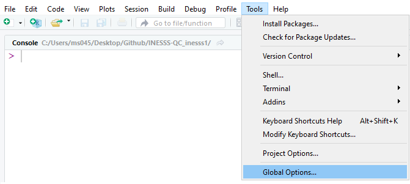
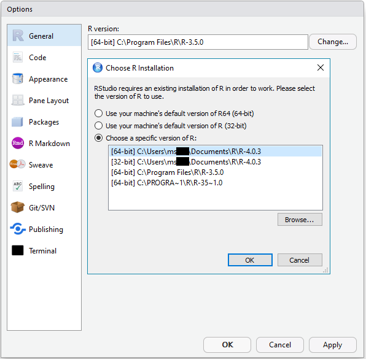
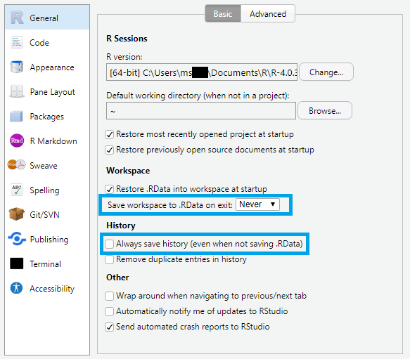
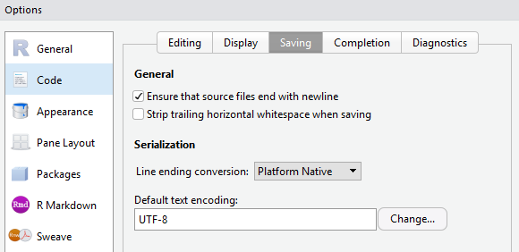

```{r, include = FALSE}
knitr::opts_chunk$set(
  collapse = TRUE,
  comment = "#>",
  fig.path = "man/figures/README-",
  out.width = "100%",
  echo = FALSE,
  results = "asis"
)
library(knitr)
library(stringr)

### Fonctions
# newpage en html ou pdf
newpage <- function(space = "3cm") {
  if (is_latex_output()) {  # si c'est pdf
    cat("\\pagebreak")
  } else {  # sinon html
    cat('<p style="page-break-before: always">')
    cat('<p style="margin-bottom:',space,'">', sep = "")
  }
}
```

# Support
Pour des questions, des commentaires ou pour désigner tout défaut de conception, écrire un courriel à `guillaume.boucher@inesss.qc.ca` et indiquer l'objet `librairie inesss`.  
La documentation à jour de la librairie est disponible [ici](https://github.com/INESSS-QC/inesss1/tree/master/Documentation).  
Pour recevoir les dernières mises à jour de la librairie, demander d'être ajouté à la liste d'envoi. Le courriel envoyé contiendra deux dossiers : 1) dossier d'installation; 2) dossier *Documentation* compressé.


# Installation de la librairie *inesss*
Puisque Microsoft Teams est accessible par un navigateur web, il est conseillé d'y avoir déposé le dossier d'installation et de le télécharger par la suite. Utile pour utiliser la librairie sur le serveur de la RAMQ.

1. Télécharger sur votre poste le dossier d'installation s'intitulant *R_inesss_x.y.z.tar.gz* où `x.y.z` est le numéro de version.
2. Copier les lignes suivantes dans la console de *RStudio* pour installer la librairie *inesss* **en prenant soin d'inscrire le répertoire et le nom du dossier d'installation**, puis appuyer sur *Entrée*.
```{r, eval=FALSE, echo=TRUE}
# Installer le package remotes au besoin :
if (!"remotes" %in% installed.packages()[,1]) install.packages("remotes")

# Installation de la librairie R inesss
remotes::install_local("Inscrire/le/répertoire/du/dossier/R_inesss_x.y.z.tar.gz", upgrade = "never")
```

**Exemple**
```{r, eval=FALSE, echo=TRUE}
remotes::install_local("E:/Desktop/MonDossier/Rpackages/R_inesss_1.0.0.tar.gz", upgrade = "never")
```


# Documentation

* **Gabarits et Outils EXCEL :** Fichiers à utiliser pour *Requêtes via Excel* et macros VBA pratiques pour Excel.
* **Vignettes :** Fichiers HTML expliquant la ou les méthodes utilisées pour certaines fonctions de la librairie.
* **AIDE-FORMULAIRE.pdf :** Comment utiliser le formulaire interactif et la section *Requêtes via Excel*. Montre également des exemples de code SQL selon les arguments demandés.
* **AIDE-FORMULAIRE-EXEMPLES-ARGUMENTS.xlsx** : Exemple de document à utiliser dans le formulaire interactif à la section *Requêtes via Excel*.
* **AIDE-FORMULAIRE-EXEMPLES-RESULTATS.xlsx** : Résultats générés à partir du fichier *AIDE-FORMULAIRE-EXEMPLES-ARGUMENTS.xlsx*.
* **inesss_x.y.z :** Documentation complète de la librairie *inesss* où *x.y.z* indique le numéro de version.
* **inesss-REGISTRE-VERSION.html :** Registre des versions. Tous les ajouts et les modifications apportées à la librairie y sont inscrits.
  

# Démarrer le formulaire
{ width=90% }


```{r}
newpage()
```


# Notes de création

## R
```{r}
cat(base::R.version$version.string)
```

## Librairies
```{r}
packages <- unlist(stringr::str_split(packageDescription("inesss")$Imports, ",\n"))
i = 1L
txt <- ""
for (pk in packages) {
  if (i > 1L) {
    if (is_html_output()) {
      txt <- paste0(txt, "<br>\n`",pk,"` v.", as.character(packageVersion(pk)))
    } else {
      txt <- paste0(txt, "\\newline\n`",pk,"` v.", as.character(packageVersion(pk)))
    }
  } else {
    txt <- paste0("`",pk,"` v.", as.character(packageVersion(pk)))
  }
  i <- i + 1L
}
cat(txt)
```


```{r}
newpage()
```


# Autres installations/désinstallations

## Installation de R {#inst}

* Télécharger la version R 4.0.5 en cliquant [ici](https://cloud.r-project.org/bin/windows/base/old/4.0.5/R-4.0.5-win.exe) (ou la dernière version [ici](https://cloud.r-project.org/bin/windows/base/)).
* Ouvrir le fichier téléchargé.
* Choisir la langue utilisée par l'assistant d'installation, puis cliquer sur *OK*.
* **Information** : Une note apparaît indiquant que vous devez avoir les privilèges d'administrateurs. Ignorer cet avertissement et cliquer sur *Suivant*.
* **Information** : Une note sur la licence et les droits d'utilisation de R apparaît. Cliquer sur *Suivant*.
* **Dossier de destination** : Choisir un répertoire où vous avez les droits d'écriture. Le répertoire par défaut `C:\Users\msXXX\Documents\R\R-4.0.5` est un bon choix. Cliquer sur *Suivant*.
* **Composants à installer** : Installer tous les composants. Cliquer sur *Suivant*.
* **Options de démarrage** : Choisir *Non (accepter les valeurs par défaut)*.
* **Sélection du dossier du menu Démarrer**  Cliquer sur *Suivant*.
* **Tâches supplémentaires** : Cliquer sur *Suivant*.
* **Fin de l'installation** : Cliquer sur Terminer.
* Ouvrir RStudio (disponible sur les postes de la RAMQ).
* Cliquer sur *Tools*, puis sur *Global Options...*.  
{ width=50% }
* À la section *R version:*, cliquer sur *Change...*, *Choose a specific version of R:*, puis sélectionner la version *[64-bit] R-4.0.5*. Cliquer sur *OK*.  
{ width=37% }
* Toujours dans les options *General* :  
{ width=40% }
  + *Save workspace to .RData on exit:*, choisir *Never*.
  + Décocher *Always save history (even when not saving .RData)*.
* Dans la section *Code*, puis *Saving*, sélectionner *UTF-8* pour le *Default text encoding:*.  
{ width=50% }
* Redémarrer RStudio pour conserver ces paramètres.
* Si les paramètres n'ont pas été sauvegardés, supprimer le dossier *RStudio-Desktop* au répertoire `C:\Users\msXXX\AppData\Local` où *msXXX* est votre numéro d'identifiant. Répéter les étapes à partir de *Cliquer sur Tools*.


## Désinstallation de R
Suivre les étapes suivantes pour supprimer une ancienne version de R installée à partir de la [section 1 *Installation de R*](#inst).

* Ouvrir le dossier contenant la version de R.  
Généralement situé au répertoire `C:\Users\msXXX\Documents\R\R-4.0.5` où *msXXX* est le numéro d'identifiant et *R-4.0.5* doit être remplacé par le numéro de version à désinstaller.
* Cliquer sur le fichier *unins000.exe*.
* Cliquer sur *Oui* pour désinstaller complètement R ainsi que tous ses composants.
* La désinstallation s'effectue, puis cliquer sur *OK* pour faire disparaître le message indiquant que R a été correctement désinstallé.
* *Facultatif* : Le dossier *R-4.0.5*, ou autre numéro de version, est toujours existant et contient toutes les librairies qui avaient été installées. Pour sauver de l'espace disque, il est conseillé de supprimer ce dossier (clic droit de la souris, puis supprimer).


## Rtools40

* Télécharger *Rtools40* en cliquant [ici](https://cran.r-project.org/bin/windows/Rtools/rtools40-x86_64.exe).
* Ouvrir le fichier téléchargé.
* Conserver les paramètres par défaut en cliquant sur *Next* à chaque étape, puis sur *Install*.
* Cliquer sur *Finish* une fois l'installation terminée.
