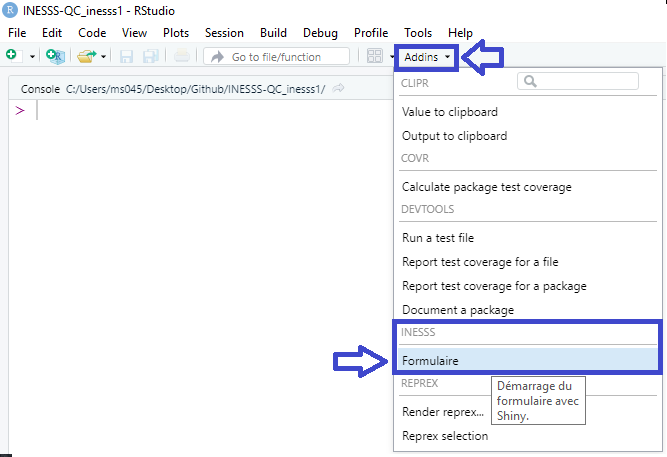

**inesss v.0.3.0**

Support
=======

Pour des questions, des commentaires ou pour désigner tout défaut de
conception, écrire un courriel à l’adresse
`guillaume.boucher@inesss.qc.ca` et indiquer l’objet
`librairie inesss`.  
La documentation de la librairie est disponible
[ici](https://github.com/INESSS-QC/inesss1/tree/master/Documentation)

Installation
============

Copier les lignes suivantes dans la console de *RStudio* pour installer
la librairie *inesss*.

``` r
if (!"remotes" %in% installed.packages()[,1]) install.packages("remotes")
remotes::install_github("INESSS-QC/inesss")
```

Démarrer le formulaire
======================



Notes de création
=================

R
-

R version 4.0.3 (2020-10-10)

Librairies
----------

`askpass` v.1.1<br> `data.table` v.1.13.4<br> `DBI` v.1.1.0<br> `fs`
v.1.5.0<br> `lubridate` v.1.7.9.2<br> `miniUI` v.0.1.1.1<br> `odbc`
v.1.3.0<br> `readxl` v.1.3.1<br> `rstudioapi` v.0.13<br> `shiny`
v.1.5.0<br> `shinydashboard` v.0.7.1<br> `shinyFiles` v.0.9.0<br>
`stringr` v.1.4.0<br> `testthat` v.3.0.1<br> `writexl` v.1.3.1
